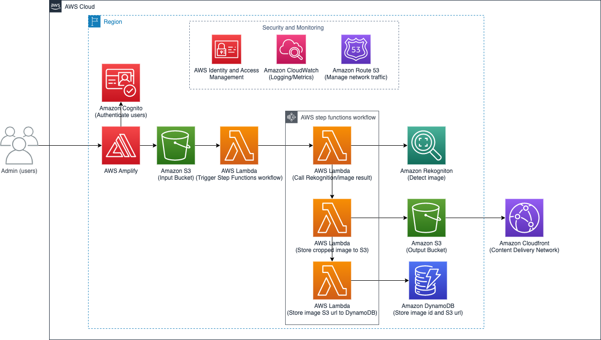

<!-- PROJECT LOGO -->
 

  

<h3 align="center">Intellicrop</h3>

  

    Intelligent Image Cropping with Managed AI/ML
     
    <a href="https://github.com/walimorris/intelli-crop-frontend"><strong>Checkout the minimal React frontend »</strong></a>
     
     
    ·
    <a href="https://github.com/walimorris/intelli-crop/issues">Report Bug</a>
    ·
    <a href="https://github.com/walimorris/intelli-crop/issues">Request Feature</a>
  

# Intellicrop
***
## High Level Overview
Intelli-Crop is a web application that uses Managed AI/ML and facial recognition to intelligently 
crop images to a fine-tuned headshot proportion. 

### Built With
* [![React][React.js]][React-url]
* [![AWS][AWS.com]][AWS-url]

Here are the technologies used in this project (this may expand in the future): 
* [Amazon Cognito](https://aws.amazon.com/cognito/) Implement secure, frictionless customer identity and access
management that scales
* [AWS Amplify](https://aws.amazon.com/amplify/) Build full-stack web and mobile apps in hours
* [AWS S3](https://aws.amazon.com/s3/) Object Storage built to retrieve any amount of data from anywhere
* [AWS Lambda](https://aws.amazon.com/lambda/) Run code without thinking about servers or clusters
* [AWS Step Functions](https://aws.amazon.com/step-functions/) Visual workflows for distributed applications
* [Amazon Rekognition](https://aws.amazon.com/rekognition/) Automate your image and video analysis with machine learning
* [Amazon DynamoDB](https://aws.amazon.com/dynamodb/) Fast, flexible NoSQL database service for single digit millisecond
performance at any scale
* [Amazon CloudFront](https://aws.amazon.com/cloudfront/) Securely deliver content with low latency and high transfer speeds
***

## Short Demo

<!-- MARKDOWN LINKS & IMAGES -->
<!-- https://www.markdownguide.org/basic-syntax/#reference-style-links -->
[license-shield]: https://img.shields.io/github/license/github_username/repo_name.svg?style=for-the-badge
[license-url]: https://github.com/github_username/repo_name/blob/master/LICENSE.txt
[linkedin-shield]: https://img.shields.io/badge/-LinkedIn-black.svg?style=for-the-badge&logo=linkedin&colorB=555
[linkedin-url]: https://www.linkedin.com/in/wali-m/
[product-screenshot]: images/screenshot.png
[React.js]: https://img.shields.io/badge/React-20232A?style=for-the-badge&logo=react&logoColor=61DAFB
[React-url]: https://reactjs.org/
[Springboot.com]: https://img.shields.io/badge/Springboot-4B6F44?style=for-the-badge&logo=springboot&logoColor=white
[Springboot-url]: https://spring.io
[AWS.com]: https://img.shields.io/badge/AWS-FF9900?style=for-the-badge&logo=amazon&logoColor=000000
[AWS-url]: https://aws.amazon.com/
